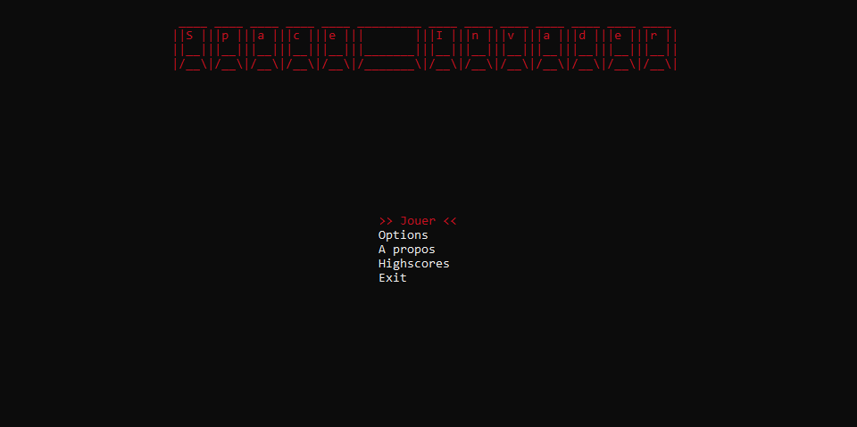
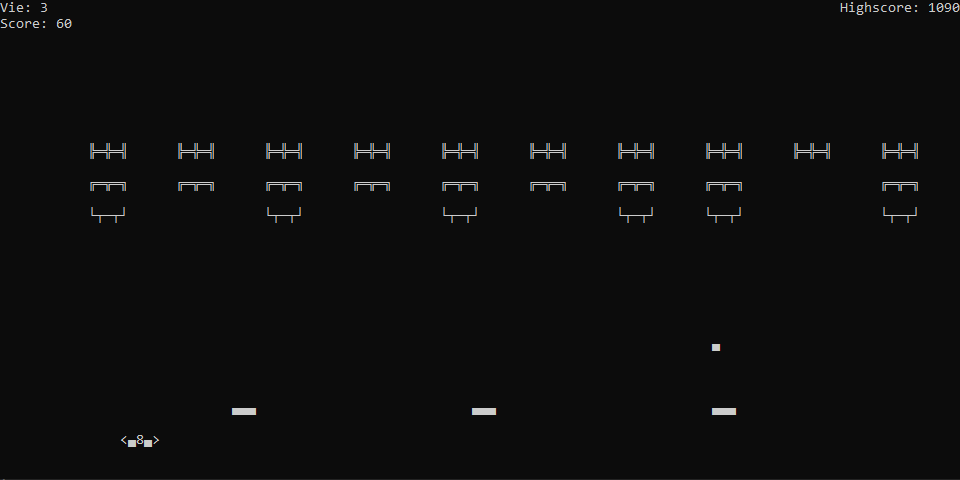

# ShootMeUp

ShootMeUp est un jeu de type shoot 'em up développé en C# pour la console. Le joueur contrôle un vaisseau spatial et doit éviter les tires tout en tirant sur les ennemis pour obtenir le meilleur score possible.

## Aperçu

### Page d'accueil

### Gameplay

